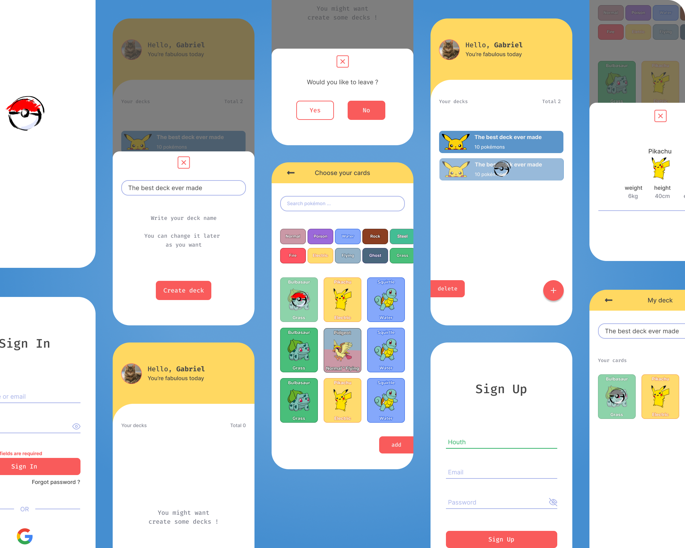

<<<<<<< HEAD
<div align="center">
=======
<div style="text-align: center">
>>>>>>> 427a1547f38e3dbfc32c2e84b8dbda2f11a854d9

## PokeDeck


</div>

##



## 💡 Purpose

This app was made to serve as a portfolio by showing my skills on these technologies that were used.

## 💻 Project

PokeDeck is about creating your own decks with your favorite pokémon cards. There's a collection of over a thousand pokémon that comes from [PokéAPI](https://pokeapi.co).

## 🛠️ Features

- [ ] OAuth2 Social Login with Google;
- [ ] Obtain additional profile information about the user (username and photo);
- [ ] Allows to create your own deck;
- [ ] Allows to choose your favorite pokémon between a huge card collection;
- [ ] Allows to update or delete both decks and cards;
- [ ] Allows to filter pokemon cards by it's name or type;

## ✨ Technologies

- [ ] React Native CLI
- [ ] TypeScript
- [ ] React Deep Linking
- [ ] React Navigation Stack
- [ ] React Native Svg & Svg Transform
- [ ] React Native Testing Library
- [ ] Jest
- [ ] OAuth2 Google
- [ ] Axios
- [ ] Context API
- [ ] Custom Hooks
- [ ] Async Storage
- [ ] Google Fonts
- [ ] PokéAPI
- [ ] Commitlint & Husky
- [ ] ESLint
- [ ] Prettier

## 🖍️ Layout

PokeDeck layout is available on Figma. You can access [through this link](https://www.figma.com/file/rqnLaSXESTIiYBta5Wdf6f/PokeDeck?node-id=0%3A1).

## 🚩 Getting Started

In case if you don't have your development environment setting up, check this [React Native Documentation](https://reactnative.dev/docs/environment-setup) to learn how to do so.

Clone this project repository

```
git clone https://github.com/gsaaraujo/PokeDeck.git
```

Type **yarn install** or **npm install** to install all dependencies.

After, run:

```
yarn start
```

And:

```
yarn android
```

**Important:** In order to use Google OAuth2, you need to register your own credentials on [Google Cloud API](https://console.cloud.google.com/apis/credentials?folder=&organizationId=&project=seismic-fx-321400) and use them on _.env-example_ file.

This app works for Android only.
